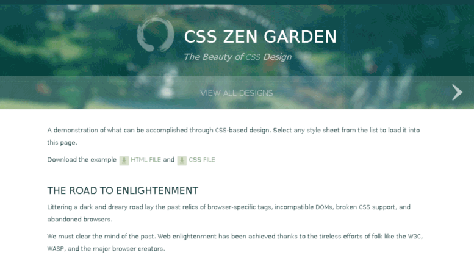

import { Head, Appear } from 'mdx-deck'
import { Split, Invert } from 'mdx-deck/layouts'

export { default as theme } from './theme'

<Head>
  <title>CSS Modules: A Subtle Introduction</title>
  <meta name='author' content='Jerome Estiller' />
</Head>

https://jromest.github.io/css-modules-deck/

---

export default Invert

## A Subtle
## Introduction to
# CSS Modules

---

## Hi, I'm Jrom
* web designer
* front end developer in training

---

## Overview
* What is CSS Modules
* Why we need CSS Modules, and;
* How to use it

---

## Disclaimer
* not an expert
* just sharing what I've learn

---

export default Invert

# Let's Begin

---

## Documents
vs
## Web Apps

---

In **Documents** you can achieve the

separation of concern

---



---

export default Split

### Structure

### Presentation

---

## Web Apps?
<Appear>
  <h2>Components</h2>
</Appear>

---

##### What we have in CSS

<Appear>
  <h2>Global Namespace</h2>
  <h2>Cascade</h2>
  <h2>Selector Specificity</h2>
</Appear>

---


---

##### What we need

<Appear>
  <h2>Modularity</h2>
  <h2>Encapsulation</h2>
  <h2>Predictability</h2>
</Appear>

---

## Tools

* CSS Methodologies (eg. BEM, ...)
* CSS in JS
* and many more...

---

export default Invert


---

## CSS Modules

<Appear>
  <p>- is a CSS file in which all class names and animation names are scoped locally by default.</p>
</Appear>

---

Before CSS Modules - using BEM

``` css
/* components/button.css */
.Button { /* all styles for Normal */ }
.Button--disabled { /* overrides for Disabled */ }
.Button--error { /* overrides for Error */ }
.Button--in-progress { /* overrides for In Progress */ }
```

``` html
<button class="Button Button--in-progress"></button>
```

---

With CSS Modules

``` css
/* components/button.css */
.normal { /* all styles for Normal */ }
.disabled { /* all styles for Disabled */ }
.error { /* all styles for Error */ }
.inProgress { /* all styles for In Progress */ }
```

---

Usage
``` js
/* components/button.js */
import styles from './button.css';

rootElem.innerHTML =
  `<button class=${styles.normal}>
    Submit
  </button>`
```

---

What is happening?
``` css
/* components/button.css */
.normal { /* all styles for Normal */ }
.disabled { /* all styles for Disabled */ }
.error { /* all styles for Error */ }
.inProgress { /* all styles for In Progress */ }
```

---

Compiles to
```css
.button__normal___1Cr0F { /* all styles for Normal */ }
.button__disabled___bKX1S { /* all styles for Disabled */ }
.button__error___3v-Bs { /* all styles for Error */ }
.button__inProgress___ZkqDo { /* all styles for In Progress */ }
```
---

When we use it
```js
rootElem.innerHTML =
  `<button class=${styles.normal}>
    Submit
  </button>`
```

```html
<button class="button__normal___1Cr0F"></button>
```

---

We able to
``` js
import styles from './button.css';
```

```json
{
  "normal": "button__normal___1Cr0F",
  "disabled": "button__disabled___bKX1S",
  "error": "button__error___3v-Bs",
  "inProgress": "button__inProgress___ZkqDo"
}
```

---

## Why CSS Modules?
modular and reusable CSS!

<Appear>
  <div>No more conflicts.</div>
  <div>Explicit dependencies.</div>
  <div>No global scope.</div>
</Appear>

---

export default Invert

## How to use
## CSS Modules

Clone this repo

https://github.com/jromest/css-modules-demo

---

Enable CSS Modules
<Appear>
  <pre>css-loader?modules</pre>
  <pre>&amp;localIdentName=[name]__[local]___[hash:base64:5]</pre>
</Appear>


---

## Naming Convention
Use camelCase instead of kebab-case

---

```js
styles.inProgress
```

vs

``` js
styles['in-progress']
```

---

export default Invert

## Composition

---

Share styles among classes

```css
composes: /* class name */;
```

---

``` css
.common {
  /* all the common styles you want */
}
.normal {
  composes: common;
  /* anything that only applies to Normal */
}
.error {
  composes: common;
  /* anything that only applies to Error */
}
```

---

Share styles among CSS files

```css
composes: /* class name */ from './file.css';
```

---

``` css
/* global.css */
.common {
  /* all the common styles you want */
}
```

``` css
.normal {
  composes: common from './global.css';
  /* anything that only applies to Normal */
}
```

---

## CSS Modules and Beyond

* Values Variables
* CSS Modules in other Languages
* [CSS Modules Repo](https://github.com/css-modules/)

---

export default Invert

## Thank you!
#### Questions?
* @jromest_ - [Twitter](https://twitter.com/jromest_)
* @jromest - [Github](https://github.com/jromest), [Codepen](https://codepen.io/jromest/)...
